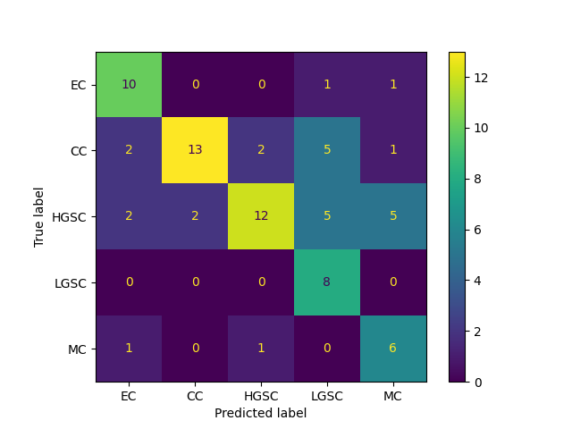

# MIL-Image-Classification

This project contains the pipeline for training and evaluating a Multiple Instance Learning (MIL) model for the classification of Images from the [UBC-OCEAN](https://www.kaggle.com/competitions/UBC-OCEAN/data) challenge using the Framework [Slideflow](https://github.com/jamesdolezal/slideflow).

---

**Table of Contents**

1. [Introduction](#1-introduction)
2. [Structure](#2-structure)
3. [Installation](#3-installation)
4. [Usage](#4-usage)
5. [Evaluation](#5-evaluation-and-metrics)
6. [Challenges](#6-ressources)
---

## 1. Introduction

As part of the **UBC** **O**varian **C**ancer subtyp**E** cl**A**ssification and outlier detectio**N** (UBC-OCEAN) competition, participants were tasked with classifying the subtype of ovarian cancer present on microscopy scans of biopsy samples.

We aimed to create a pipeline for easy training and evaluation of MIL models for the detection of ovarian cancer subtypes using the Framework slideflow. It also includes code to tile the Whole Slide Images (WSI) that the dataset largely consists of into 512x512 patches and the creation of bags using a feature extractor.

This pipeline was developed as part of an internship at the Chair of IT Infrastructures for Translational Medical Research at the University of Augsburg in collaboration and exchange with a team of other students. Each student created their own pipeline.

---

## 2. Structure

The repository is compartmented into a number of distinct folders.

| Folder | Content                                                     | Created during pipeline |
| ------ | -------                                                     | ----------------------  |
| images     | Any images created during the execution of the pipeline | No                      |
| bags       | Bags created during the feature extraction              | Yes                     |
| evaluation | Evaluation of models                                    | Yes
| models     | Trained models, including weights                       | Yes                     |
| src        | All scripts, including the pipeline                     | No                      |
| src/legacy | Legacy code for creating a train, test and validation split for the data | No    |

---


## 3. Installation

1. Clone the repository
```git clone https://github.com/WaibelJonas/MIL-Image-Classification.git```
3. Create a virtual environment
```python3 -m venv .venv```
4. Install dependencies
```pip3 install -r requirements.txt```

---

## 4. Usage

### 4.1 Pipeline

Executing the pipeline can be done in 2 ways:

1. Execute the distinct pipeline steps (tiling.py >> bags.py >> train.py >> evaluation.py) seperately and in order, allowing you to skip already completed steps

    - tiling.py: Tiles the images in the dataset by batchwise converting them to pyramid tiffs (original WSI are extremely large PNGs) and extracting 512x512 tiles
```python3 src/tiling.py```
    - bags.py: Creates bags using one of the feature extractors provided by slideflow (histossl by default)
```python3 src/bags.py```
    - train.py: Trains models in a k-folds approach. The folds are passed via a .json file which was created by our Teammate Emilio Borrelli. For further information see his project.
```python3 src/train.py```
    - evaluation.py: Evaluates the models with regards to a number of classification [metrics](#5-evaluation-and-metrics).
```python3 evaluation.py```
2. Execute main.py, which encompasses the entire pipeline. This option also allows to skip individual steps such as tiling or bags if they've already been completed.
```python3 main.py --skip-tiling --skip-bags```

### 4.2 Adapting the project

Adapting the project paths and hyperparameters to your specific environment and needs can be done by modifying the global variables in utils.py.

| Variable              | Description                                                               |
|-----------------------|---------------------------------------------------------------------------|
| **RANDOM_SEED**        | Random seed for reproducing results                                       |
| **PROJECT_PATH**       | Root project folder path                                                  |
| **BAGS_PATH**          | Path to the bags folder                                                   |
| **MODEL_PATH**         | Path to the models folder                                                 |
| **EVALUATION_PATH**    | Path to the evaluation folder                                             |
| **IMAGE_PATH**         | Path to image folder                                                      |
| **DATASET_PATH**       | Path to the dataset folder                                                |
| **SHARE_PATH**         | Path to the shared folder                                                 |
| **TFRECORD_PATH**      | Path to the TFRecord folder                                               |
| **SPLIT_PATH**         | Path to the splits JSON file                                              |
| **TILE_SIZE**          | Size of each tile in pixels                                               |
| **TILE_UM**            | Magnification level of the tiles (e.g., "20x")                            |
| **CLEAR_BUFFER**       | Whether to clear the TIFF buffer after processing                         |
| **TIFF_BUFFER_SIZE**   | Size of the TIFF buffer                                                   |
| **FEATURE_EXTRACTOR**  | Feature extractor to use (e.g., "histossl")                               |
| **LEARNING_RATE**      | Learning rate for model training                                          |
| **BATCH_SIZE**         | Batch size for model training                                             |
| **EPOCHS**             | Number of epochs for model training                                       |

---

## 5. Evaluation

In a Team effort between all participants in the internship, we settled on a number of metrics in order to make our results comparable. These are:

- Balanced Accuracy
- ROC AUC Score
- Average Precision

Additionally, a classification report and a confusion matrix are produced. The output of evaluating a model should look something like this (along with a new entry in the evaluation folder)

```
...
...
--- Fold 3 ---
           INFO     Building model Attention_MIL (n_in=768, n_out=5)                                                                                                                                                                                           
           INFO     Loading model weights from /data/waibeljo/MIL-Image-Classification/models/00003-attention_mil-label/models/best_valid.pth                                                                                                                  
           WARNING  Bags missing for 11 slides.                                                                                                                                                                                                                
           INFO     Predictions saved to /data/waibeljo/MIL-Image-Classification/evaluation/00003-attention_mil/predictions.parquet                                                                                                                            
           INFO     Validation metrics for outcome label:                                                                                                                                                                                                      
           INFO     slide-level AUC (cat # 0): 0.974 AP: 0.936 (opt. threshold: 0.315)                                                                                                                                                                         
           INFO     slide-level AUC (cat # 1): 0.873 AP: 0.772 (opt. threshold: 0.221)                                                                                                                                                                         
           INFO     slide-level AUC (cat # 2): 0.938 AP: 0.933 (opt. threshold: 0.185)                                                                                                                                                                         
[14:36:34] INFO     slide-level AUC (cat # 3): 0.965 AP: 0.718 (opt. threshold: 0.371)                                                                                                                                                                         
           INFO     slide-level AUC (cat # 4): 0.998 AP: 0.982 (opt. threshold: 0.406)                                                                                                                                                                         
           INFO     Category 0 acc: 85.7% (12/14)                                                                                                                                                                                                              
           INFO     Category 1 acc: 69.2% (9/13)                                                                                                                                                                                                               
           INFO     Category 2 acc: 60.0% (18/30)                                                                                                                                                                                                              
           INFO     Category 3 acc: 75.0% (3/4)                                                                                                                                                                                                                
           INFO     Category 4 acc: 100.0% (7/7)                                                                                                                                                                                                               
           INFO     Attention scores exported to /data/waibeljo/MIL-Image-Classification/evaluation/00003-attention_mil/attention/20329_att.npz                                                                                                                
              precision    recall  f1-score   support

          EC       0.80      0.86      0.83        14
          CC       0.64      0.69      0.67        13
        HGSC       0.86      0.60      0.71        30
        LGSC       0.38      0.75      0.50         4
          MC       0.70      1.00      0.82         7

    accuracy                           0.72        68
   macro avg       0.68      0.78      0.70        68
weighted avg       0.76      0.72      0.72        68

Balanced accuracy:  0.7798901098901099 
ROC AUC:            0.9492986748286306 
Average precision:  0.8950314059855238 
--- Fold 4 ---
           INFO     Building model Attention_MIL (n_in=768, n_out=5)                                                                                                                                                                                           
           INFO     Loading model weights from /data/waibeljo/MIL-Image-Classification/models/00004-attention_mil-label/models/best_valid.pth                                                                                                                  
           WARNING  Bags missing for 7 slides.                                                                                                                                                                                                                 
           INFO     Predictions saved to /data/waibeljo/MIL-Image-Classification/evaluation/00004-attention_mil/predictions.parquet                                                                                                                            
           INFO     Validation metrics for outcome label:                                                                                                                                                                                                      
           INFO     slide-level AUC (cat # 0): 0.999 AP: 0.996 (opt. threshold: 0.546)                                                                                                                                                                         
           INFO     slide-level AUC (cat # 1): 0.917 AP: 0.749 (opt. threshold: 0.330)                                                                                                                                                                         
[14:36:35] INFO     slide-level AUC (cat # 2): 0.819 AP: 0.811 (opt. threshold: 0.235)                                                                                                                                                                         
           INFO     slide-level AUC (cat # 3): 0.851 AP: 0.416 (opt. threshold: 0.182)                                                                                                                                                                         
           INFO     slide-level AUC (cat # 4): 0.918 AP: 0.647 (opt. threshold: 0.126)                                                                                                                                                                         
           INFO     Category 0 acc: 100.0% (15/15)                                                                                                                                                                                                             
           INFO     Category 1 acc: 77.8% (14/18)                                                                                                                                                                                                              
           INFO     Category 2 acc: 46.9% (15/32)                                                                                                                                                                                                              
           INFO     Category 3 acc: 72.7% (8/11)                                                                                                                                                                                                               
           INFO     Category 4 acc: 50.0% (2/4)                                                                                                                                                                                                                
           INFO     Attention scores exported to /data/waibeljo/MIL-Image-Classification/evaluation/00004-attention_mil/attention/29615_att.npz                                                                                                                
              precision    recall  f1-score   support

          EC       0.68      1.00      0.81        15
          CC       0.74      0.78      0.76        18
        HGSC       1.00      0.47      0.64        32
        LGSC       0.44      0.73      0.55        11
          MC       0.33      0.50      0.40         4

    accuracy                           0.68        80
   macro avg       0.64      0.69      0.63        80
weighted avg       0.77      0.68      0.67        80

Balanced accuracy:  0.694760101010101  
ROC AUC:            0.9007068989601169 
Average precision:  0.7690842482803645 

 --- Average metrics ---
Average balanced accuracy:  0.742085489326336  
Average ROC AUC:            0.9173437203457914 
Average average precision:  0.819590204805794 
```



---

## 5. Challenges

Due to the extreme pixel count and the unconventional Image format (Whole Slide Images are not commonly stored as PNGs), tiling the data posed a challenge, since slideflow was unable to process the original images. As a result, the tiling process involves first converting the images into pyramid TIFFs and then tiling them. This is done in small batches to reduce memory consumption.

Unfortunately, slideflow is unable to detect the appropriate microns-per-pixel itself using this approach. This might be patched in future versions (we were using slideflow 3.0.0) but for the time being There are 2 ways of circumventing this issue:

1. (Our Solution) Manually pass the mpp into every instance of WSI in ```slideflow/dataset.py``` i.e
```
slide = sf.WSI(path, mpp=0.5, **wsi_kwargs)
```
2. Utilize one of the pretiled datasets provided by other participants on Kaggle and configure hyperparamaters such as tile size and um accordingly. Examples include:

    - [256x256](https://www.kaggle.com/competitions/UBC-OCEAN/discussion/446104)
    - [512x512](https://www.kaggle.com/competitions/UBC-OCEAN/discussion/451908)

---


### 6. Ressources

- UBC-OCEAN: https://www.kaggle.com/competitions/UBC-OCEAN/overview

- Slideflow: https://github.com/jamesdolezal/slideflow
